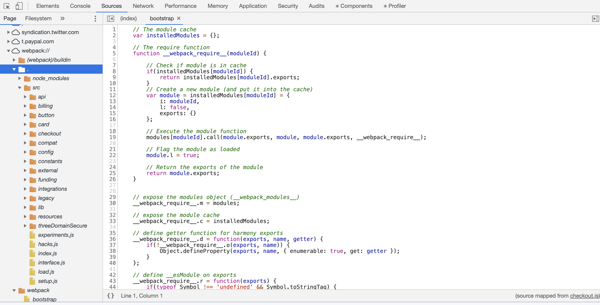

# sourcemap-extractor

ウェブサイトの中には sourcemap というメタデータが公開状態になっているサイトがあります。



こういったソースが見られるサイトでは webpack の設定が緩くて、ソースコードの完全復元が可能だったりします。

そういったサイトでは `*.js.map` というファイルをダウンロードしてくれば、ソースコードをこのツールで展開することができます。

## 使い方

```sh
$ yarn
$ yarn build
$ bin/sourcemap-extractor <sourcemap.js.map> <output directory>
```
